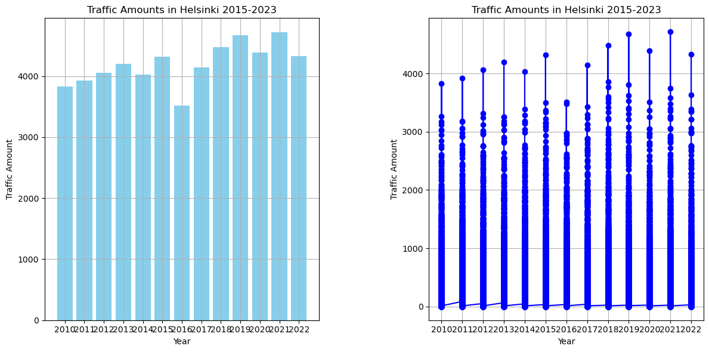

# This is the cartogis portfolio
##  test test test
## let´s test to plot map here:


# ANOTHER ONE


# HEADER
Lorem Ipsum is simply dummy text of the printing and typesetting industry. Lorem Ipsum has been the industry's standard dummy text ever since the 1500s, when an unknown printer took a galley of type and scrambled it to make a type specimen book. It has survived not only five centuries, but also the leap into electronic typesetting, remaining essentially unchanged. It was popularised in the 1960s with the release  Letraset sheets containing Lorem Ipsum passages, and more recently with desktop publishing software like Aldus PageMaker including versions of Lorem Ipsum.


# ANOTHER ONE




# HEADER
Lorem Ipsum is simply dummy text of the printing and typesetting industry. Lorem Ipsum has been the industry's standard dummy text ever since the 1500s, when an unknown printer took a galley of type and scrambled it to make a type specimen book. It has survived not only five centuries, but also the leap into electronic typesetting, remaining essentially unchanged. It was popularised in the 1960s with the release  Letraset sheets containing Lorem Ipsum passages, and more recently with desktop publishing software like Aldus PageMaker including versions of Lorem Ipsum.

```html
<div style="display: inline-block;">
    <iframe src="map_2015.html" width="800" height="600" style="margin-right: 10px;"></iframe>
</div>
<div style="display: inline-block;">
    <iframe src="map_2020.html" width="800" height="600"></iframe>
</div>

<div style="display: inline-block;">
    <iframe src="map_2020.html" width="800" height="600" style="margin-right: 10px;"></iframe>
</div>
<div style="display: inline-block;">
    <iframe src="map_2023.html" width="800" height="600"></iframe>
</div>

All values in the same map. Press to see the NO2-value.

<iframe src="all_markers_blue_red.html" width="800" height="600"></iframe>

# Press play to visualize air quality year-by-year.

<iframe src="slider_and_markers.html" width="800" height="600"></iframe>
<iframe src="traffic_map_with_slider.html" width="800" height="600"></iframe>


<div style="display: inline-block;">
    <iframe src="slider_and_markers.html" width="800" height="600" style="margin-right: 10px;"></iframe>
</div>
<div style="display: inline-block;">
    <iframe src="traffic_map_with_slider.html" width="800" height="600"></iframe>
</div>

<iframe src="combined_map_with_slider.html" width="1000" height="800"></iframe>

CONCLUSION

<div style="display: inline-block;">
    <iframe src="map_2015.html" width="800" height="600" style="margin-right: 10px;"></iframe>
</div>
<div style="display: inline-block;">
    <iframe src="map_2020.html" width="800" height="600" style="margin-right: 10px;"></iframe>
</div>

<div style="display: inline-block;">
    <iframe src="map_2023.html" width="800" height="600" style="margin-right: 10px;"></iframe>
</div>
<div style="display: inline-block;">
    <iframe src="all_markers_blue_red.html" width="800" height="600"></iframe>
</div>

<div style="display: inline-block;">
    <iframe src="slider_and_markers.html" width="800" height="600" style="margin-right: 10px;"></iframe>
</div>
<div style="display: inline-block;">
    <iframe src="traffic_map_with_slider.html" width="800" height="600"></iframe>
</div>

<div style="display: inline-block;">
    <iframe src="combined_map_with_slider.html" width="1000" height="800"></iframe>
</div>


