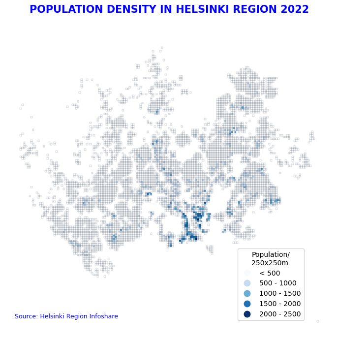
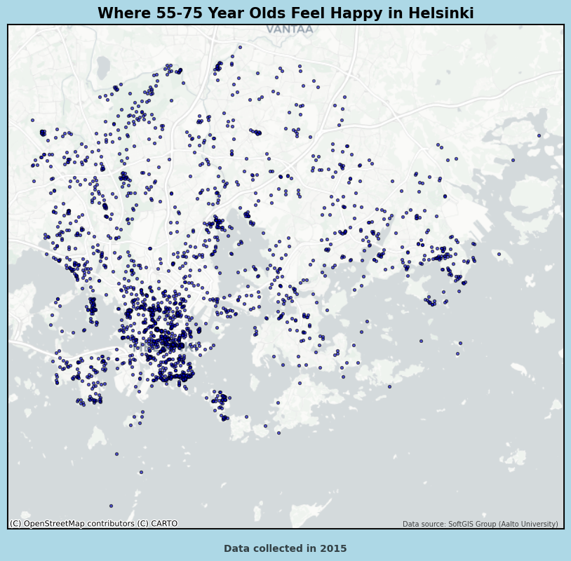
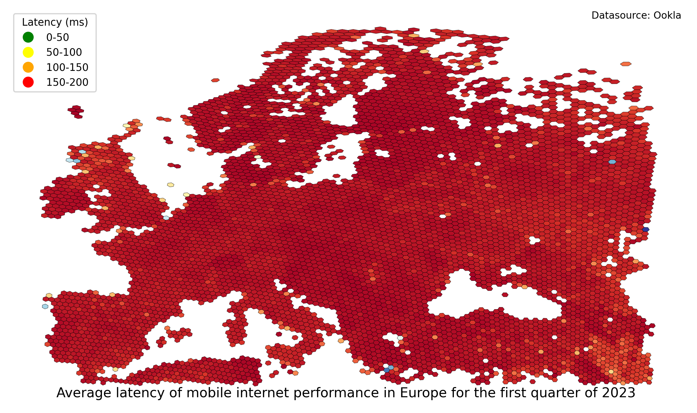
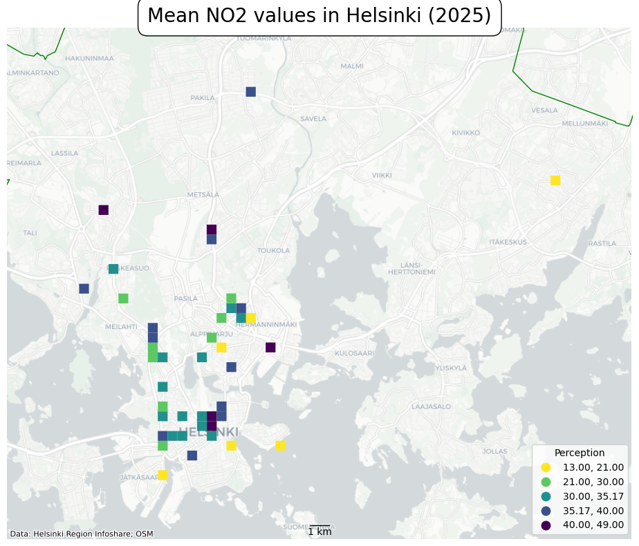
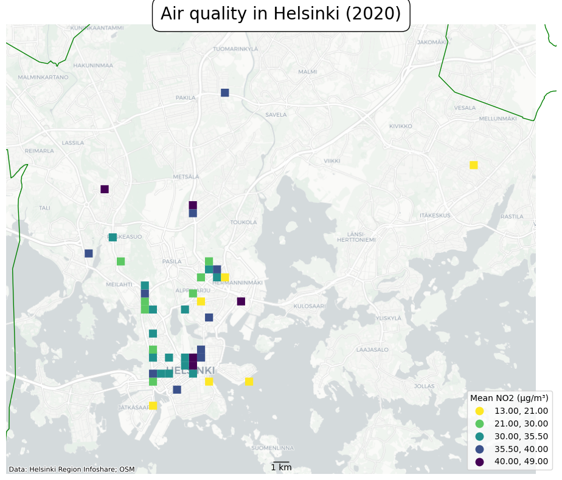
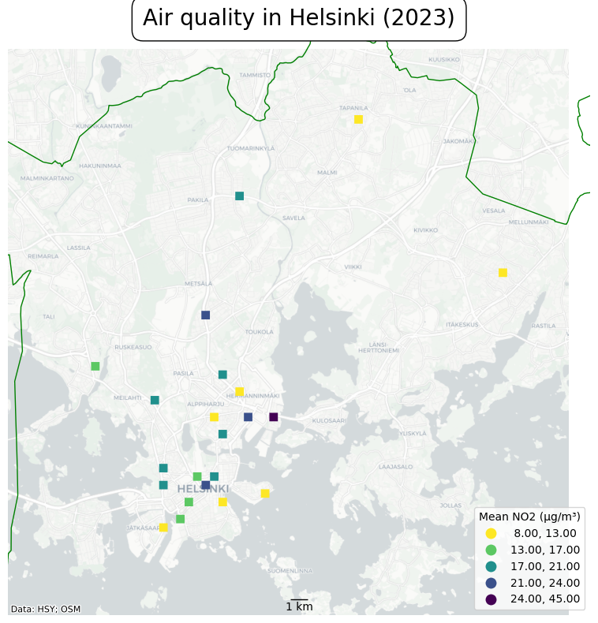
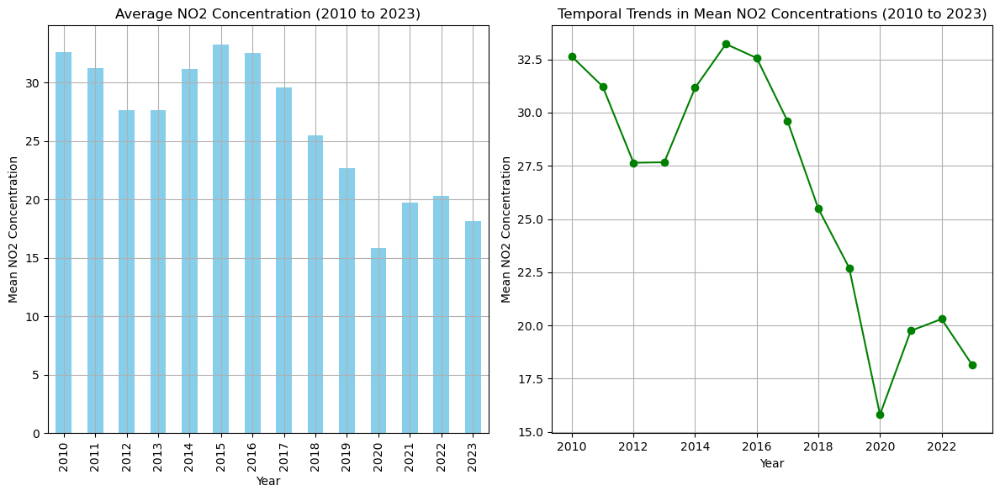
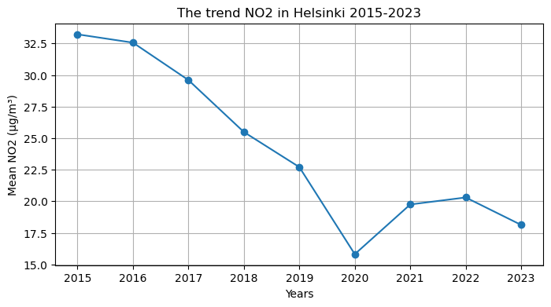
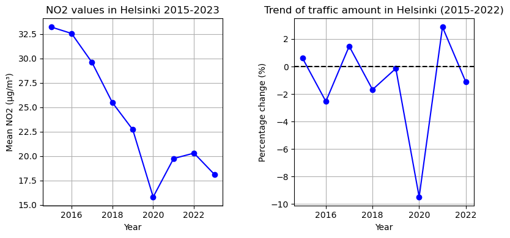

<!DOCTYPE html>
<html lang="en">
<head>
    <meta charset="UTF-8">
    <meta name="viewport" content="width=device-width, initial-scale=1.0">
    <title>Cartogis Portfolio</title>
    
</head>
<body>
    <h1>Cartogis Portfolio</h1>
    
    
    <h1>toimiik2ffffffffffffo</h1>
    
     
Here are some maps I created as part of my coursework.

    
    
    
    <!-- Images -->
    <h3>Population density of Helsinki:</h3>
    

    <h3>Where people aged 55-75 feel happy in Helsinki:</h3>
    
    
    <h3>About the mobile internet latencies in Europe:</h3>
    <!-- Map of Europe -->
    
   

    <!-- Maps -->
    <h6>And this is where the story begins...</h6>
    
    <h2>NO2:</h2>
    <!-- Embedded YouTube Video -->
    <iframe width="560" height="315" src="https://www.youtube.com/embed/GVBeY1jSG9Y?si=jR_lifNTAlhSQSE7" frameborder="0" allowfullscreen></iframe>

     <!-- Maps -->
    <h4>Change:</h4>
    
    
    
    
    
    
    

    <h2>Let's now see some interactive maps...</h2>
      <!-- First set of maps -->
    

        <iframe src="map_2015.html"></iframe>
    

    

        <iframe src="map_2020.html"></iframe>
    

    
  
</body>    
</html>
