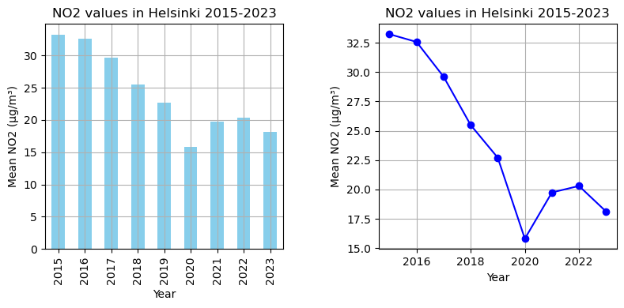

<!DOCTYPE html>
<html lang="en">
<head>
    <meta charset="UTF-8">
    <meta name="viewport" content="width=device-width, initial-scale=1.0">
    <title>Cartogis Portfolio</title>
    
</head>
<body>
    <h1>This is the portfolio page of the Helsinki University Cartogis course made by Lauri Levomäki </h1>
    
    <h1>In this page, you can see some maps made during the course, and storytelling section about air quality in Helsinki, Finland. </h1>
    
    
First, some maps I created as part of my coursework.

    <!-- Images -->
    <h3>Population density of Helsinki:</h3>
    

    <h3>Where people aged 55-75 feel happy in Helsinki:</h3>
    
    
    <h3>About the mobile internet latencies in Europe:</h3>
    <!-- Map of Europe -->
    
   
    <!-- Maps -->
    <h6>And this is where the story begins...</h6>
    
    <h1>Air quality data explore in Helsinki city</h1>
    
      
Air pollution, particularly from nitrogen dioxide (NO2), is a significant environmental and public health concern in urban areas like Helsinki. NO2 is primarily emitted from vehicles, industrial processes, and combustion of fossil fuels. Exposure to NO2 and other air pollutants can have detrimental effects on human health, including respiratory issues, cardiovascular diseases, and even premature death.
       

     
  
Given the detrimental impact of air pollution on public health, it's crucial to monitor and analyze air quality data. By conducting such analyses and creating maps, policymakers, urban planners, and citizens can better understand the spatial and temporal distribution of air pollution within the city. This understanding can inform targeted interventions and policies aimed at reducing pollution levels, mitigating public health risks, and improving overall urban livability.

    
    
    <!-- Embedded YouTube Video -->
    <iframe width="560" height="315" src="https://www.youtube.com/embed/GVBeY1jSG9Y?si=jR_lifNTAlhSQSE7" frameborder="0" allowfullscreen></iframe>

 
    <!-- Maps -->
    <h4>Change:</h4>
    
    
    
    
    
    
    
    
    
    
      
   
    
    <h2>Let's now see some interactive maps...</h2>
    <h4>Let´s first see the changes between 2015 and 2020 (covid-19 year)</h4>
    <!-- Flex container for iframes -->
    

        <!-- First set of maps -->
        

            <iframe src="map_2015.html"></iframe>
        

        

            <iframe src="map_2020.html"></iframe>
        

    

    <h4>And next the changes between 2020 and 2023</h4>
    <!-- Flex container for iframes another set -->
    

        <!-- First set of maps -->
        

            <iframe src="map_2020.html"></iframe>
        

        

            <iframe src="map_2023.html"></iframe>
        

    

    
    <h4>To explore all the years alle slider and markers</h4>
    
    <h4>How´s the traffic been changing durin thsese years</h4>
    
    
   
    
    
    
    <h4>Traffic slider alle</h4>
    
    <h4>We can see how the these factors are correlating, and the effect of covid-19 </h4>
    
    
     <h4>tähän scatterplot</h4>
    
    
    <h4> And finally, air quality and traffic together between 2015-2023</h4>
    
    

            <iframe src="combined_map_with_slider.html"></iframe>
        

    
    
   
    
    
    <h4>Change:</h4>
    
    <h4>Datasources: Helsinki Region Infoshare</h4>
    
     <h4>Python libraries used for the maps and charts:</h4>
    
    
    
    

     
      
    
  
</body>    
</html>
